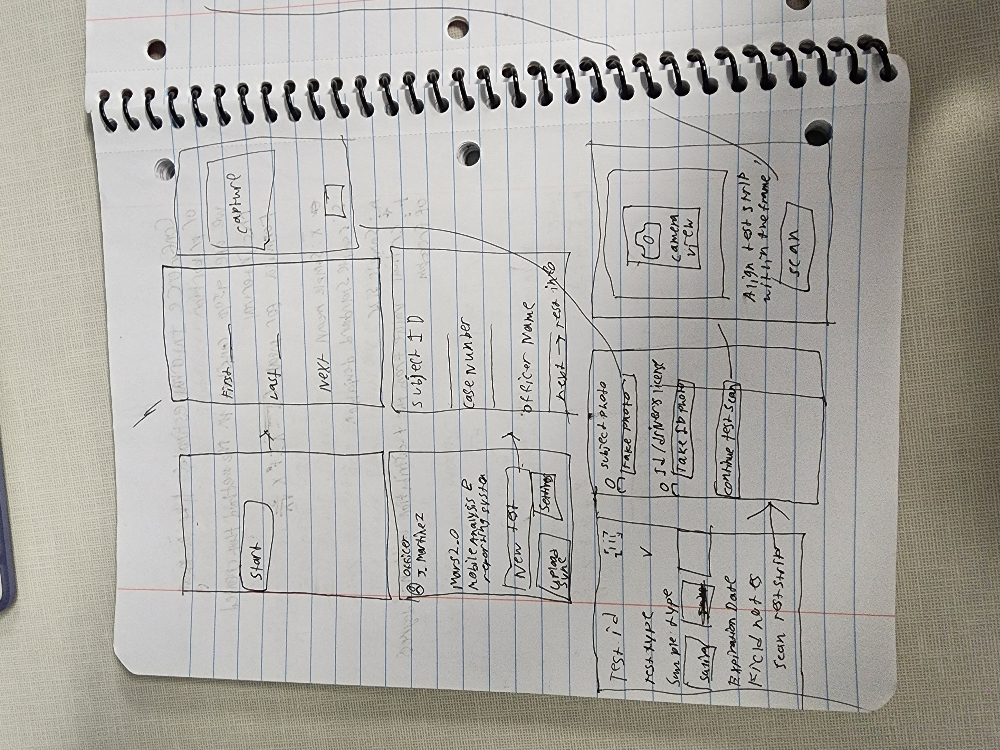
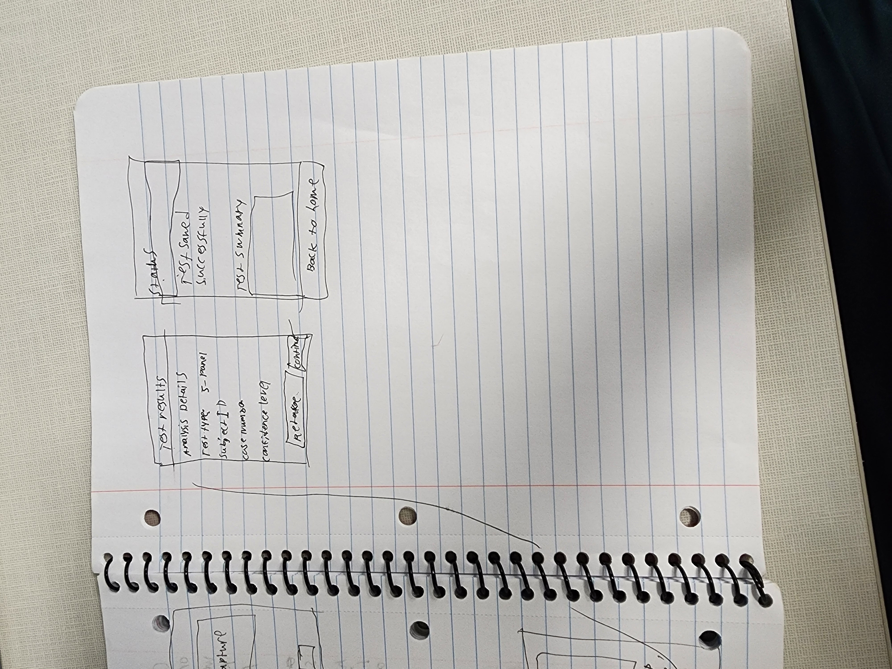

# MARS 2.0 - Mobile Analysis & Reporting System

A professional React Native application designed for law enforcement officers to conduct, document, and manage field drug tests with integrated photo capture and data synchronization capabilities.

## Description

MARS 2.0 (Mobile Analysis & Reporting System) is a comprehensive mobile application built for law enforcement professionals to streamline the field drug testing process. The application provides a complete workflow from subject identification through test administration, photo documentation, result analysis, and secure data storage. All test data is stored locally on the device with synchronization capabilities for secure transmission to central databases when network connectivity is available.

The application guides officers through a structured six-step testing process: capturing subject details, recording test information, photographing the subject and their identification, scanning the test strip, analyzing results with confidence levels, and confirming successful data storage. This systematic approach ensures comprehensive documentation while maintaining chain of custody requirements.

---

## Wireframes

## iOS Human Interface Guidelines Implementation

### Navigation and Clarity

MARS 2.0 follows Apple’s Human Interface Guidelines in a way that keeps the app simple, intuitive, and easy to move through. The app uses familiar iOS navigation patterns: a tab bar for the main sections and a stack-based flow for the step-by-step test process. This helps users always understand where they are and how to go back, with the tab bar providing quick access to Home and Settings.

During the test workflow, each screen clearly shows the current step with a descriptive title and a visible back button. When a user tries to cancel mid-process, the app uses the standard iOS confirmation alert with a red “destructive” action button, helping prevent accidental data loss. On the final confirmation screen, the back button is removed to avoid navigating back into saved results, which matches Apple’s guidance for modal and final-state screens.

### Visual Design and Interaction

The visual design sticks closely to Apple’s guidelines for layout, color, and typography. All interactive elements meet the minimum 44x44 point touch target, making the app usable even in field conditions. Spacing stays consistent with 16-point margins throughout, giving the interface a clean and organized look.

The app uses a navy blue primary color (#1a237e) with strong contrast so text and controls remain accessible. Buttons follow standard iOS hierarchy: filled navy for primary actions, outlined styles for secondary actions, and red (#f44336) for destructive actions like Cancel. Disabled elements use reduced opacity for clear feedback on their state.

Text fields use native iOS styling, and the keyboard automatically adapts to the input type (for example, auto-capitalization for case numbers). Required fields are marked with red asterisks. The app also uses the native iOS date picker to match user expectations.

Camera permissions appear only at the moment they’re needed, with clear explanation text following Apple’s “Requesting Permissions” guidelines. Status indicators use both color and icons/text (e.g., green for synced and orange for pending) to ensure accessibility for color-blind users.
